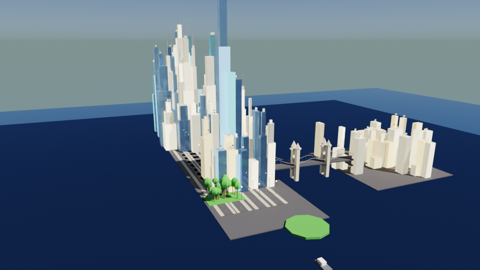
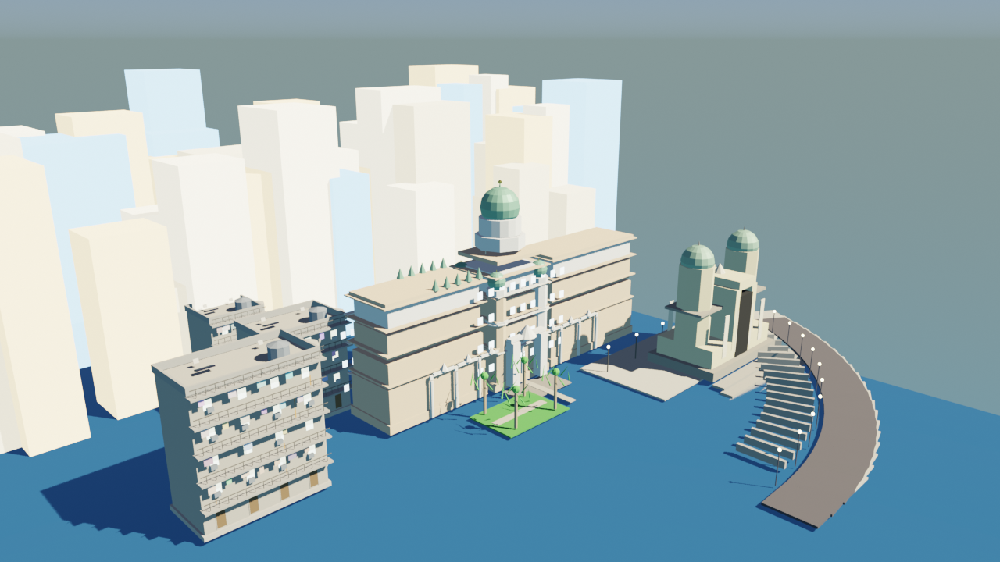

# Biometric City

A real-time 3D city visualization that displays live biometric and urban data for NYC and Mumbai. Built with Three.js on the frontend and a FastAPI WebSocket backend.

## Stack

- **Frontend** — Three.js + Vite + GSAP
- **Backend** — FastAPI + WebSockets + APScheduler
- **3D Modeling** — Blender (scripts included)

## Project Structure

```
biometric-city/
├── backend/          # FastAPI WebSocket server
│   ├── main.py
│   ├── requirements.txt
│   └── data/         # City data aggregator
├── frontend/         # Three.js Vite app
│   ├── src/
│   ├── index.html
│   └── package.json
├── blender_city_scene.py       # Base city scene script
├── blender_nyc_landmarks.py    # NYC landmarks
├── blender_nyc_detailed.py     # NYC detailed version
├── blender_nyc_v2.py           # NYC v2
├── blender_mumbai_landmarks.py # Mumbai landmarks
└── start.sh                    # Starts both servers
```

## 3D Assets

The `frontend/public/models/` directory contains FBX models and textures (~23MB) used for city props and structures. These are not tracked in git due to size. Place your FBX assets there before running the frontend.

## Blender Files

The `.blend` files (`nyc_v2.blend`, etc.) are not tracked in git due to size. Run the corresponding Python scripts inside Blender's scripting panel to regenerate them.

## Preview

| NYC | Mumbai |
|-----|--------|
|  |  |

## Getting Started

**Backend**
```bash
cd backend
python -m venv venv
source venv/bin/activate
pip install -r requirements.txt
uvicorn main:app --reload
```

**Frontend**
```bash
cd frontend
npm install
npm run dev
```

**Or run both at once:**
```bash
./start.sh
```

App runs at `http://localhost:5173`, backend at `http://localhost:8000`.
