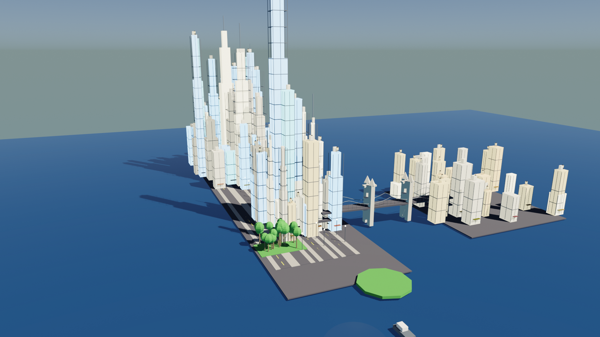

# Biometric City

Real-time 3D city visualization for NYC and Mumbai, overlaid with live biometric and urban data. Buildings pulse with activity. Data streams in over WebSockets. Built as an exploration of what it looks like when a city becomes observable.


## What it does

A Three.js scene renders a procedurally structured city. A FastAPI backend pushes live data over WebSockets — biometric signals, urban activity metrics, crowd density approximations — and the city reacts in real time. District-level data updates animate across the skyline.

Two cities are modeled: New York and Mumbai. Blender scripts are included for the 3D asset generation so the scenes can be extended or rebuilt.

## Stack

| | |
|---|---|
| Frontend | Three.js, Vite, GSAP |
| Backend | FastAPI, WebSockets, APScheduler |
| 3D Modeling | Blender (Python scripts) |

## Project Structure

```
biometric-city/
├── backend/
│   ├── main.py               # FastAPI WebSocket server
│   ├── requirements.txt
│   └── data/                 # City data aggregation layer
├── frontend/
│   ├── src/
│   ├── index.html
│   └── package.json
├── blender_city_scene.py       # Base city scene
├── blender_nyc_landmarks.py    # NYC landmarks
├── blender_nyc_detailed.py     # NYC detailed pass
├── blender_nyc_v2.py           # NYC v2
├── blender_mumbai_landmarks.py # Mumbai
└── start.sh
```

## Running it

```bash
# Backend
cd backend
pip install -r requirements.txt
uvicorn main:app --reload

# Frontend (separate terminal)
cd frontend
npm install
npm run dev
```

Or just:

```bash
./start.sh
```

## Previews

| NYC | NYC Detailed | Mumbai |
|---|---|---|
|  |  |  |
